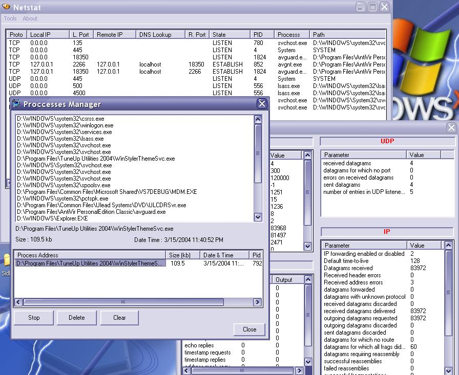



## View Process \(Vb Netstat\)

### Description

By this application you can see all of the processes which open the port TCP/UDP, it is like Netstat program, you can see the Destination IP address and the its port number. But in this application you can stop the process, even send the process files to Recycle Bin. Besides that, this application can show the information of the all files which running too. So this is so usefull to make firewall application. And I have added the telnet server and Client in this application, so you can see the result in vbNetstat. So don&#226;&#8364;&#8482;t forget vote me if you like this.
 
### More Info
 

             |
---                |---
**Submitted On**   |2006-03-29 06:50:02
**By**             |[Wardana](https://github.com/Planet-Source-Code/PSCIndex/blob/master/ByAuthor/wardana.md)
**Level**          |Beginner
**User Rating**    |5.0 (10 globes from 2 users)
**Compatibility**  |VB 6\.0
**Category**       |[Internet/ HTML](https://github.com/Planet-Source-Code/PSCIndex/blob/master/ByCategory/internet-html__1-34.md)
**World**          |[Visual Basic](https://github.com/Planet-Source-Code/PSCIndex/blob/master/ByWorld/visual-basic.md)
**Archive File**   |[View\_Proce1983833292006\.zip](https://github.com/Planet-Source-Code/wardana-view-process-vb-netstat__1-64843/archive/master.zip)

